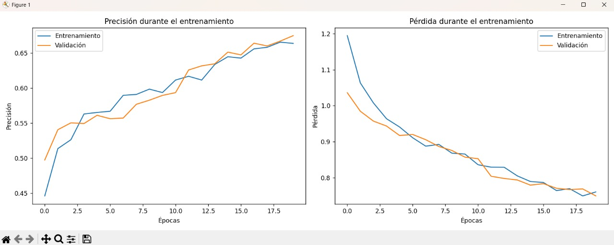
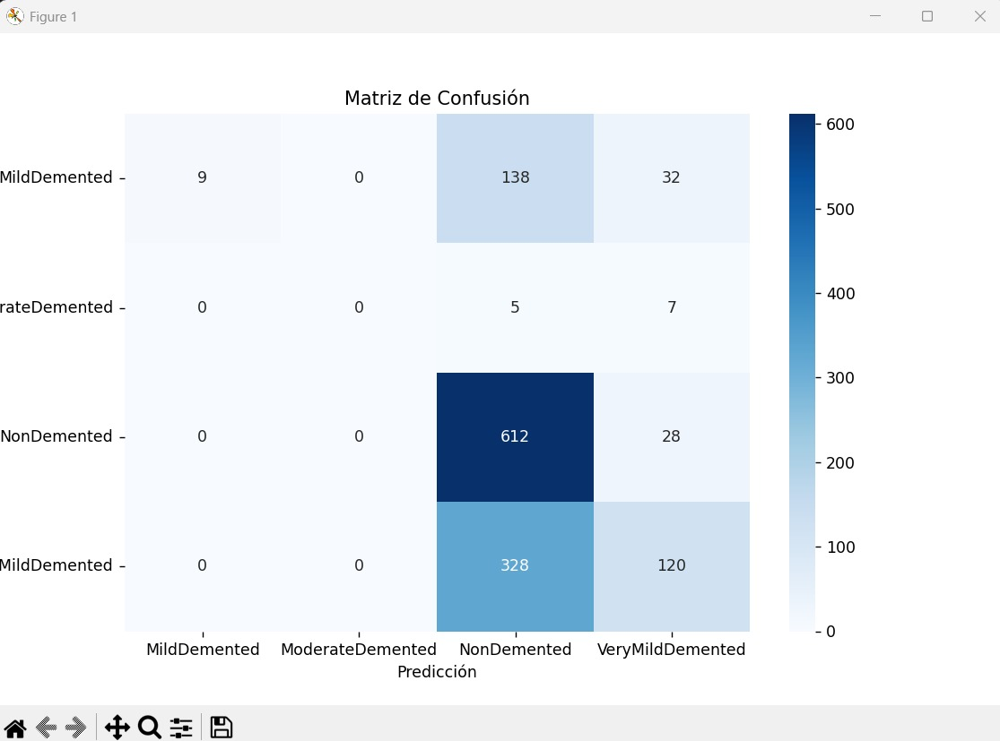

# Clasificación de Alzheimer con MobileNetV2

Este proyecto busca construir un modelo de deep learning capaz de clasificar imágenes de resonancias magnéticas cerebrales para detectar distintos estados del Alzheimer. Está orientado a apoyar el diagnóstico médico automatizado, facilitando una detección temprana y precisa de esta enfermedad neurodegenerativa.

---

## Objetivos del Proyecto

- Clasificar imágenes de resonancia magnética cerebral en cuatro categorías clínicas:  
  - **NonDemented**  
  - **VeryMildDemented**  
  - **MildDemented**  
  - **ModerateDemented**

- Probar modelos del estado del arte aplicados al dominio biomédico.
- Mejorar el rendimiento a través de **fine-tuning**, aumento de datos y ajuste de hiperparámetros.

---

## Modelo Usado: MobileNetV2

El modelo central es **MobileNetV2**, una red convolucional profunda eficiente y ligera, diseñada para ejecutarse en dispositivos con recursos limitados. Está basada en:

> **MobileNetV2: Inverted Residuals and Linear Bottlenecks**  
> *Mark Sandler, Andrew Howard, et al. — Google AI (2018)*  
> [🔗 Paper en arXiv](https://arxiv.org/abs/1801.04381)

MobileNetV2 ofrece un buen equilibrio entre precisión y eficiencia computacional, y ha sido usado exitosamente en tareas de clasificación médica.

---

## Artículos del Estado del Arte

A continuación, se presentan trabajos científicos recientes que respaldan o contrastan la implementación usada en este proyecto:

1. **Deep Learning for Alzheimer's Disease Diagnosis: A Survey**  
   Publicado en *Artificial Intelligence in Medicine* (2022).  
   🔗 [https://www.sciencedirect.com/science/article/abs/pii/S0933365722000975](https://www.sciencedirect.com/science/article/abs/pii/S0933365722000975)

2. **A Proficient Approach for the Classification of Alzheimer's Disease Using a Hybridization of Machine Learning and Deep Learning**  
   Publicado en *Scientific Reports* (2024).  
   🔗 [https://www.nature.com/articles/s41598-024-81563-z](https://www.nature.com/articles/s41598-024-81563-z)

3. **A Comparative Study of Deep Learning Techniques for Alzheimer's Disease Detection in Medical Radiography**  
   Publicado en *IJCSNS* (2024).  
   🔗 [https://www.researchgate.net/publication/381002805](https://www.researchgate.net/publication/381002805)

---

## ⚙️ Implementación

El proyecto fue desarrollado con **TensorFlow + Keras**. Se utilizaron técnicas de:

- Aumento de datos (data augmentation)
- Transfer learning (MobileNetV2 preentrenada en ImageNet)
- Fine-tuning (ajuste fino de las últimas 30 capas)
- Dropout para prevenir overfitting

### Arquitectura Personalizada

- `GlobalAveragePooling2D`
- `Dropout(0.3)`
- `Dense(512, ReLU)`
- `Dropout(0.3)`
- `Dense(4, Softmax)`

---

## Dataset

Conjunto de datos: **Alzheimer's MRI Dataset**  
Dividido en:

- `train/` → 4098 imágenes  
- `val/` → 1023 imágenes  
- `test/` → 1279 imágenes  

---

## Resultados de la Primera Iteración

La primera versión del modelo usó solo la base congelada de MobileNetV2 sin fine-tuning.

| Métrica     | Valor     |
|-------------|-----------|
| Accuracy    | 54.34%    |
| Precision   | 0.51      |
| Recall      | 0.58      |
| F1-score    | 0.51      |

Se observó un sesgo hacia la clase **NonDemented**, con bajo rendimiento en clases minoritarias.

---

## Resultados de la Iteración Mejorada (Fine-tuning y más capas)

### Reporte de Clasificación

| Clase              | Precision | Recall | F1-score | Soporte |
|--------------------|-----------|--------|----------|---------|
| MildDemented       | 1.00      | 0.05   | 0.10     | 179     |
| ModerateDemented   | 0.00      | 0.00   | 0.00     | 12      |
| NonDemented        | 0.57      | 0.96   | 0.71     | 640     |
| VeryMildDemented   | 0.64      | 0.27   | 0.38     | 448     |

| Promedio           | Accuracy | Precision | Recall | F1-score |
|--------------------|----------|-----------|--------|----------|
| Macro average      | 0.58     | 0.55      | 0.32   | 0.30     |
| Weighted average   | 0.58     | 0.65      | 0.58   | 0.50     |

**Precisión en el set de prueba: 57.94%**

Mejora notable en las métricas globales, aunque aún se identifican desafíos en las clases menos representadas.

---

## Visualizaciones

### Matriz de Confusión



### Curvas de Precisión y Pérdida



---

## Interpretación de Resultados

- El modelo mejoró la precisión general con fine-tuning y capas densas personalizadas.
- Se sigue observando un **desbalance** en las clases, especialmente **ModerateDemented**, lo que impacta las métricas macro.
- El uso de MobileNetV2 permitió mantener un entrenamiento eficiente y tiempos razonables.

---

## Referencias

1. Sandler, M., et al. *"MobileNetV2: Inverted Residuals and Linear Bottlenecks"*. arXiv, 2018.  
   🔗 https://arxiv.org/abs/1801.04381  
2. Gupta, R., et al. *"Deep Learning for Alzheimer's Disease Diagnosis: A Survey"*. Artificial Intelligence in Medicine, 2022.  
   🔗 https://www.sciencedirect.com/science/article/abs/pii/S0933365722000975  
3. Kalra, A., et al. *"A Proficient Approach for the Classification of Alzheimer's Disease..."*. Scientific Reports, 2024.  
   🔗 https://www.nature.com/articles/s41598-024-81563-z  
4. Ilyas, S., et al. *"A Comparative Study of Deep Learning Techniques for Alzheimer's Disease Detection..."*. IJCSNS, 2024.  
   🔗 https://www.researchgate.net/publication/381002805  

---

## Cómo ejecutar

```bash
python Modelo_Alzheimer.py
```

